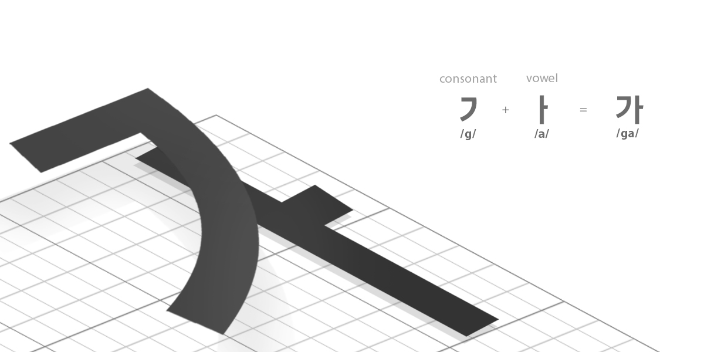
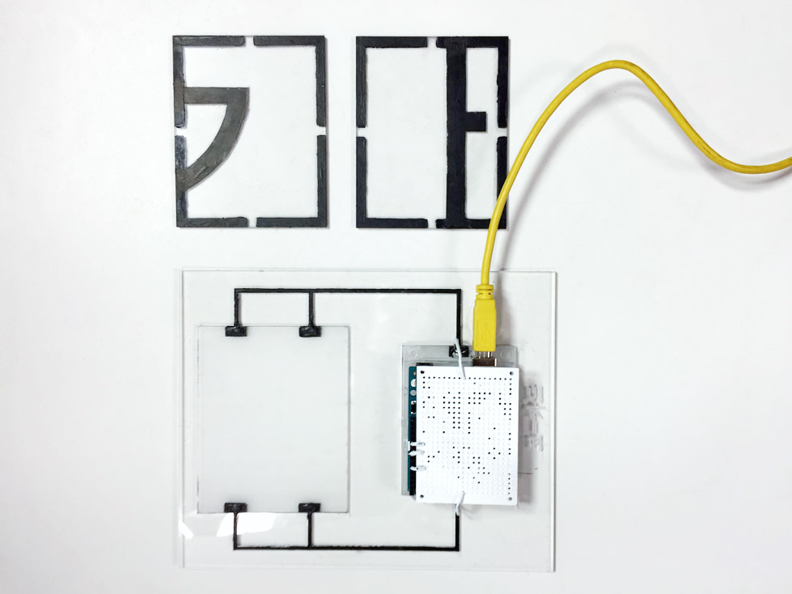

# GoCard

Go Card is a concept of language education kit.

The Korean letters are written in syllabic blocks with each alphabetic letter placed vertically and horizontally into a square dimension. 

Using that characteristic, we designed an education kit for learning Korean letters.

We chose “ㄱ" + “ㅏ” = “가“, 가 is the most simple and basic letter when you learn Korean as we learn A, B, C in English. 가 also has a meaning of ‘Go’, so we named our kit as Go Card.

## System
Each vowel and the consonant card has its own sound. 

The user can hear them when they press the card on the kit. 

When they stack the cards together, they can learn how the consonant and the vowel combine to make a sound.

The kit is designed with acrylic sheet and conductive paint, and an Arduino board. Programmed with P5.js.

Using the diffrent lenght of each letter’s stroke, we designed each sound ‘ㄱ', ‘ㅏ', and ‘가‘ to have different resistance.

